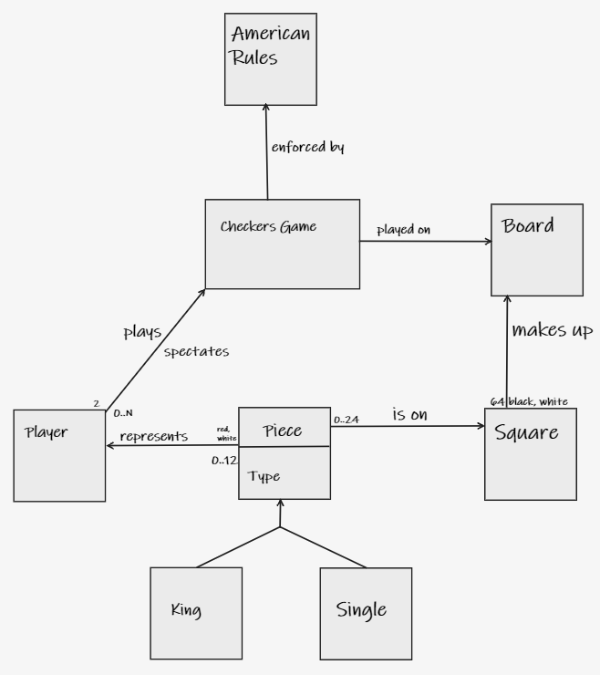
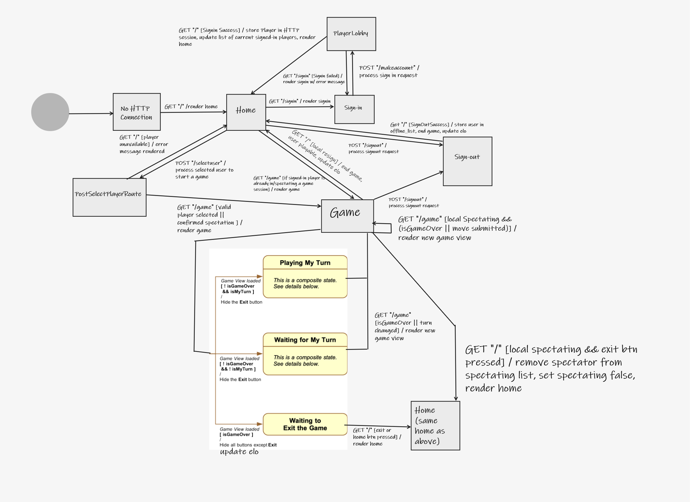
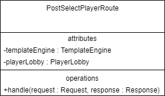
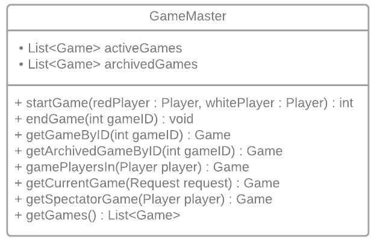
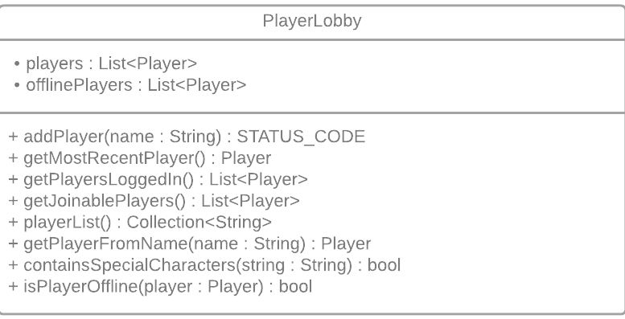
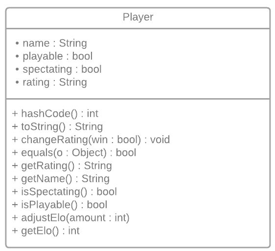
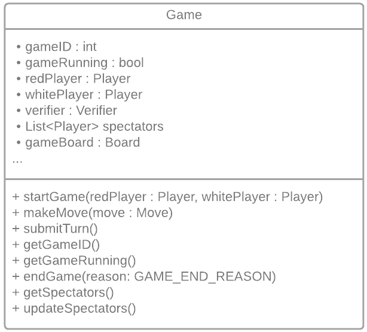
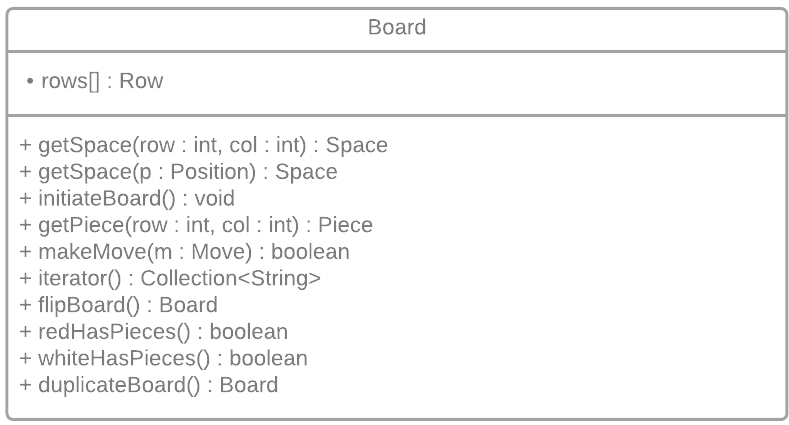

# WebCheckers Design Documentation

## Team Information
* Team name: 2B
* Team members
  * Daniel Bliss
  * Charlie Reilly
  * Josh Gottschall
  * Gavin Hearn
  * Liang Liu

## Executive Summary

This project is a web-based application for playing checkers with another player across the internet. The project allows players to sign-in, challenge other players, spectate other games, and keep up with stats while playing.

### Purpose
The goal of this project is to create a web-based checkers game that is easy to use, efficient, and free of any bugs or errors. We took on this project to learn how to work as a team when developing software. We are using this project as a means to learn Agile, Git, and the process of developing projects in the software engineering field. We are attempting to achieve a greater understanding of the spark interface, and developing applications that rely on it.

### Glossary and Acronyms

| Term | Definition |
|------|------------|
| VO | Value Object |
| MVP | Minimum Viable Product |
| UML | Unified Modeling Language |

## Requirements

This section describes the features of the application.

### Definition of MVP
The MVP defines the "Minimum Viable Product," stating the minimum functionality requirements the user must meet in order for the product to be considered "viable" for that sprint.

### MVP Features
The following is a list of stories that are important for the MVP:
* As a player, I want to be able to play a game of checkers with another player
* As a player, I want to be able to sign-in so I can challenge other registered players
* As a player, I want the game to be enforced by the American rules
* As a player, I want to be able to end the game at any point in time with a resignation

### Enhancements
On top of creating the functional checkers game, we plan implemented the following enhancements
* A spectator system so players can spectate other games
* A basic "elo" system so players can keep track of their skill, and locate other players of a similar strength

## Application Domain

This section describes the application domain.

This domain model is centered around the Checkers game, how it will be played, what the rules are, and what makes up the game. On a high level, a game contains a board, which is made up of squares containing pieces. The game is enforced by the American rules. User's represent players that can play or spectate the game.

## Architecture and Design

This section describes the application architecture.

### Summary

The following Tiers/Layers model shows a high-level view of the webapp's architecture.

As a web application, the user interacts with the system using a
browser.  The client-side of the UI is composed of HTML pages with
some minimal CSS for styling the page.  There is also some JavaScript
that has been provided to the team by the architect.

The server-side tiers include the UI Tier that is composed of UI Controllers and Views.
Controllers are built using the Spark framework and View are built using the FreeMarker framework.  The Application and Model tiers are built using plain-old Java objects (POJOs).

Details of the components within these tiers are supplied below.

### Overview of User Interface

This section describes the web interface flow; this is how the user views and interacts
with the WebCheckers application.

When the user types the URL into the address bar, they are creating a new HTTP connection, and calling `GET /`. This redirects the user to the home page. From there they can click a link to access the sign in. After the player is signed in, they are transitioned to the PlayerLobby, where they can select players. By selecting a player, they transition to the PostSelectPlayerRoute, which forwards the player to the Game state with the player they chose. The other player (who is currently in the Home state) is also redirected to the Game state. 

The GameMaster relies on Game ID's in order to determine which specific game instance to load. When the Game ID cannot be obtained through the player, then it relies on a Game ID param given in the GET request.

### UI Tier
The UI tier of the program is essentially the "middleman" between the HTML/JS and the Java code managing the game. It handles all GET and POST requests that the user may make, and forwards applicable information over to the instances needed to process that information. The UI tier can also take information from the other objects and forward it to the HTML/JS to be displayed to the user. Essentially, whenever a user clicks a button, opens a new page, submits a form, etc. a class in the UI tier is invoked.

Every UI tier class is implements the Route class from Spark. This means that they are required to have the method: `handle(Request request, Response respone)`, where `request` is the HTTP request and `response` is the HTTP response. These functions are called when either a GET or POST request is made depending on the class. This is where the majority of the code to other classes take place. After the function is done handling the request, it returns any nessecarry code for the UI, such as HTML to be displayed.

An example of a standard UI tier class can be shown with this UML chart:

Each route can also feature some global variables. The first is a template engine. This is created per class, and handles creating HTML to then be displayed on screen. Each route can also be equipped with an instance of the PlayerLobby class or GameMaster class. These classes store information on the players and games. It's initiated in the WebServer class, and is passed on when these routes are created. Information in these classes are then read or modified by the routes.

### Application Tier
The application tier contains information of classes that handle other classes. Basically, the classes in here store various instances related to those classes. Currently, there are two classes that are in this tier:
* GameMaster
* PlayerLobby

When the server is initialized, the WebServer creates an instance of the `GameMaster` class, which is then sent to any classes that need it upon construction. This GameMaster class maintains a list of all running Game instances, and when they are complete, any completed Game instances that can be retrived for later use. The GameMaster class contains various methods that allow classes to start games, end games, and fetch a certain game based on an ID, Player, etc. Below is the UML Diagram for that class. Game's are a part of the model tier, and are explained below.

The `PlayerLobby` contains code to handle Player classes, a class in the model tier. This can create new players, stores a list of current players, and can send information regarding the current player list, the UML diagram can be seen below:

### Model Tier
The model tier consists of classes that are initiated to handle functionality within the program, most of these eventually being connected to a class in the Application tier. Essentially, one class in this tier is used to store information on one instance of that class. Below are the most important classes within this tier.

`Player` classes represent a player. They are given a string to store the player's name, and gets created when the player signs in with a name that does not yet exist. These classes are created by and stored in the PlayerLobby class.

`Game` classes represent a game. They take in two different players, one red and one white, and provides the functionality to play a game of checkers. The game class creates a Board, another model class, to store all the information related to the pieces on the board. (More on that below). Games are created and stored in the GameMaster class.

`Board` classes represent a board. It is created and stored in the Game class, and houses various other instances to create a game board. The board stores 8 instances of the "Row" class, with the row classes storing 8 instances of a space, which then store a piece if nessecarry. The board can move pieces, remove pieces, and can keep an overall count of the number of pieces remaning on the board. The board does not handle checking the validity of moves, it simply moves.

`Validator` provides the logic to check if a move is valid or not. It's created by the Game class at the start of each turn. The validator's main function is checkTurn(), which takes in an instance of the Move class, and returns a status code relating to whether the move is valid or not and why. The Validator can also check the board to discover if there are any hops avaliable as part of the verification process. The validator does not make any moves, the game is in charge of interperting the move codes and making them if deemed appropriate.

`Move` and `Position` represent moves and positions on the board. Move stores a position to indicate the start and end of the moves, while position stores the row and col of a specific spot on the board. These are used throught all of the classes with managaing pieces.

### Design Improvements
Some design changes that could be made is to make the Route classes based off of a superclass. While programming, we often reuse code from other classes. As a result, a potential design improvement could be to make a superclass for all the POST and GET routes, then make the specific routes extend the superclass.

Various other enhancements can also be included. These may include a replay system, or allowing one player to play multiple games at once.

## Testing

### Acceptance Testing
At current, we have completed three user stories that have passed all acceptance criteria tests. The user stories that are being developed for the sprint--and therefore failing acceptance criteria--are in the majority. For example, we have four stories in development, and a few more in the product backlog. During Sprint 1, we came across a couple failing acceptance criteria. We were not able to solve these issues until the beginning of Sprint 2. We hope, with the introduction of JUnits, that we can identify these failing criteria in a timely manner.

### Unit Testing and Code Coverage
All packages are at least 90% covered. This is important for a game like checkers as each move comes with various logic checks, and making sure that each branch is covered by the JUnit is critical to ensure accuracy. As of writing, the UI and Application tier are at 100% coverage, while the Model tier sits at 'X' coverage.